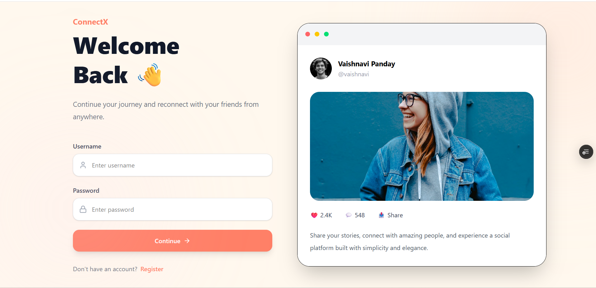
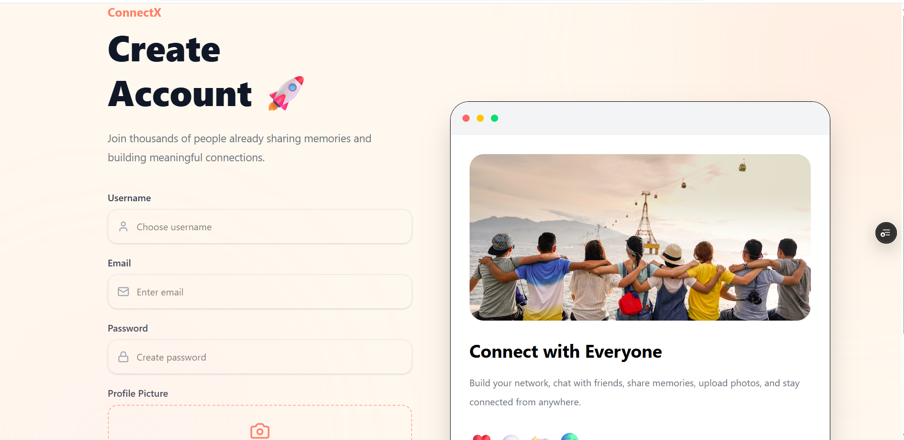
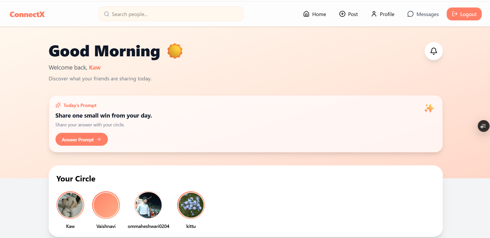
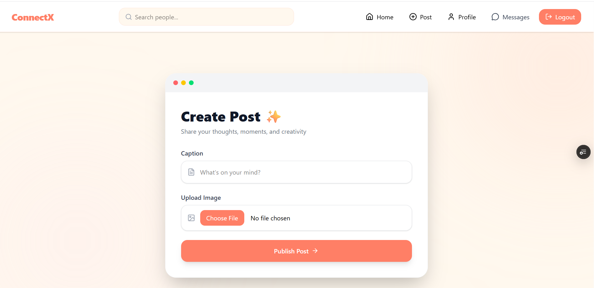
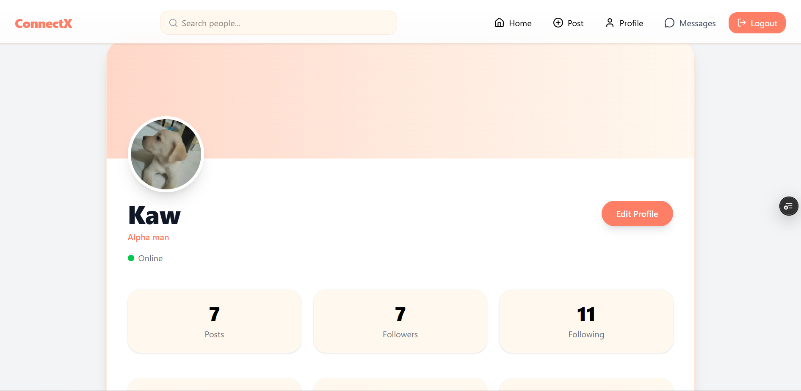
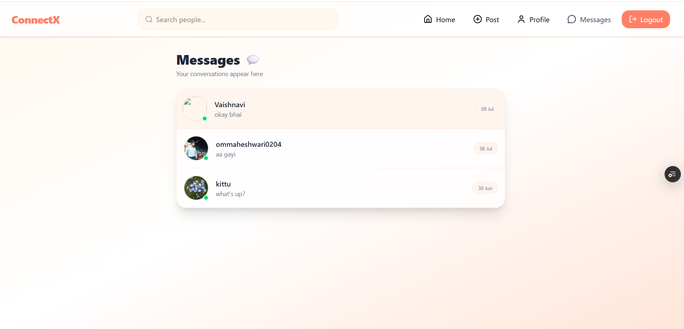
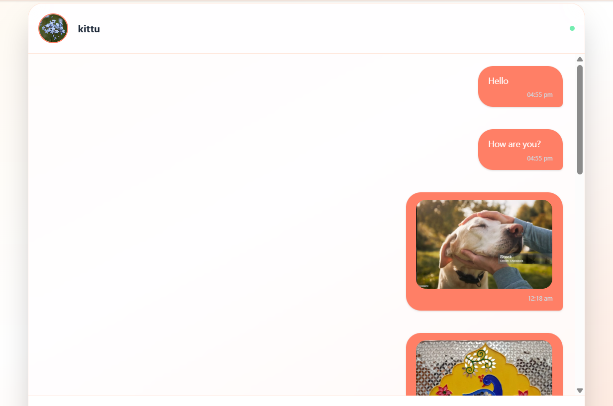
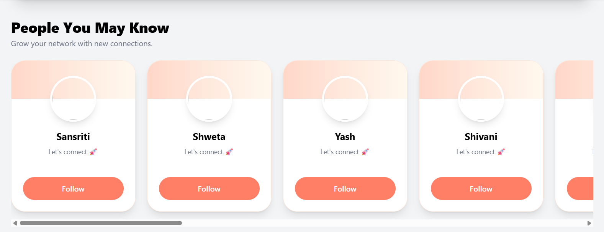

# ConnectX — Social Media Platform

ConnectX is a full-stack social media platform where users can create profiles, share image posts, interact with others, follow people, and chat in real time.

It is built to provide a modern social networking experience with features such as daily prompts, post interactions, user discovery, and unread message notifications.

## Features

### Authentication

* User registration and login
* Secure authentication using JWT and cookies
* Logout functionality
* Protected routes for authenticated users

### Profile Management

* View user profiles
* Edit bio and profile picture
* Follow and unfollow users
* View followers and following lists
* Suggested people section

### Posts

* Create image posts with captions
* Image upload validation
* Like and unlike posts
* Comment on posts
* Delete own posts
* View posts on profile pages
* Feed containing posts from followed users

### Daily Prompts

* A new prompt is shown every day
* Users can respond to the daily prompt through a post
* Prompt response badge is displayed on related posts
* Same prompt is shared by all users on the same day

### Messaging

* One-to-one real-time messaging
* Chat list with latest message preview
* Unread message count in navbar
* Unread message count for each chat
* Mark messages as seen when a chat is opened
* Online user status support

### Search

* Search users by username
* Navigate directly to user profiles from search results

## Tech Stack

### Frontend

* React.js
* React Router DOM
* Axios
* Tailwind CSS
* Lucide React Icons
* Socket.io Client

### Backend

* Node.js
* Express.js
* MongoDB
* Mongoose
* JWT Authentication
* Cookie Parser
* Multer
* ImageKit
* Socket.io
* Express Validator

## Project Structure

```text
ConnectX/
│
├── Frontend/
│   ├── src/
│   │   ├── components/
│   │   ├── context/
│   │   ├── pages/
│   │   ├── App.jsx
│   │   └── main.jsx
│   └── package.json
│
├── Backend/
│   ├── src/
│   │   ├── controllers/
│   │   ├── middleware/
│   │   ├── models/
│   │   ├── routes/
│   │   ├── utils/
│   │   └── app.js
│   └── package.json
│
└── README.md
```

## Installation and Setup

### 1. Clone the repository

```bash
git clone https://github.com/your-username/connectx.git
cd connectx
```

### 2. Install backend dependencies

```bash
cd Backend
npm install
```

### 3. Create backend environment variables

Create a `.env` file inside the Backend folder:

```env
PORT=3000
MONGODB_URI=your_mongodb_connection_string
JWT_SECRET=your_jwt_secret

IMAGEKIT_PUBLIC_KEY=your_imagekit_public_key
IMAGEKIT_PRIVATE_KEY=your_imagekit_private_key
IMAGEKIT_URL_ENDPOINT=your_imagekit_url_endpoint

CLIENT_URL=http://localhost:5173
```

### 4. Start backend server

```bash
npm run dev
```

### 5. Install frontend dependencies

Open another terminal:

```bash
cd Frontend
npm install
```

### 6. Start frontend server

```bash
npm run dev
```

The frontend will usually run at:

```text
http://localhost:5173
```

## Important API Routes

### Authentication

```text
POST   /api/auth/register
POST   /api/auth/login
POST   /api/auth/logout
GET    /api/auth/me
```

### Users

```text
GET    /api/user/all
GET    /api/user/search
GET    /api/user/:id
PUT    /api/user/updateprofile/:id
POST   /api/user/:id/user
```

### Posts

```text
POST   /api/post/create
GET    /api/post/feed
GET    /api/post/daily-prompt
PATCH  /api/post/:id/likes
POST   /api/post/:id/comment
DELETE /api/post/:id/post
```

### Messages

```text
POST   /api/message/send/:id
GET    /api/message/chats
GET    /api/message/unread-count
GET    /api/message/unread-per-user
PATCH  /api/message/:id/read
```

## Screenshots










## Future Improvements

* Notifications for likes, comments, and follows
* Post editing feature
* Story feature
* Dark mode
* Email verification
* Password reset flow
* Group chats
* Message reactions
* Post bookmarks
* Better mobile navigation
* Infinite scrolling feed

## Learning Outcomes

Through this project, I practiced:

* Building REST APIs with Express.js
* Authentication using JWT and HTTP-only cookies
* MongoDB schema design with Mongoose
* File upload handling with Multer and ImageKit
* React state management using Context API
* Protected frontend routes
* Real-time communication using Socket.io
* Form validation on frontend and backend
* Building responsive UI using Tailwind CSS

## Author

**Vaishnavi Panday**

* GitHub: https://github.com/vaishnavi-panday
* LinkedIn: https://www.linkedin.com/in/vaishnavi-panday-558447342/

## License

This project is created for learning and portfolio purposes.
